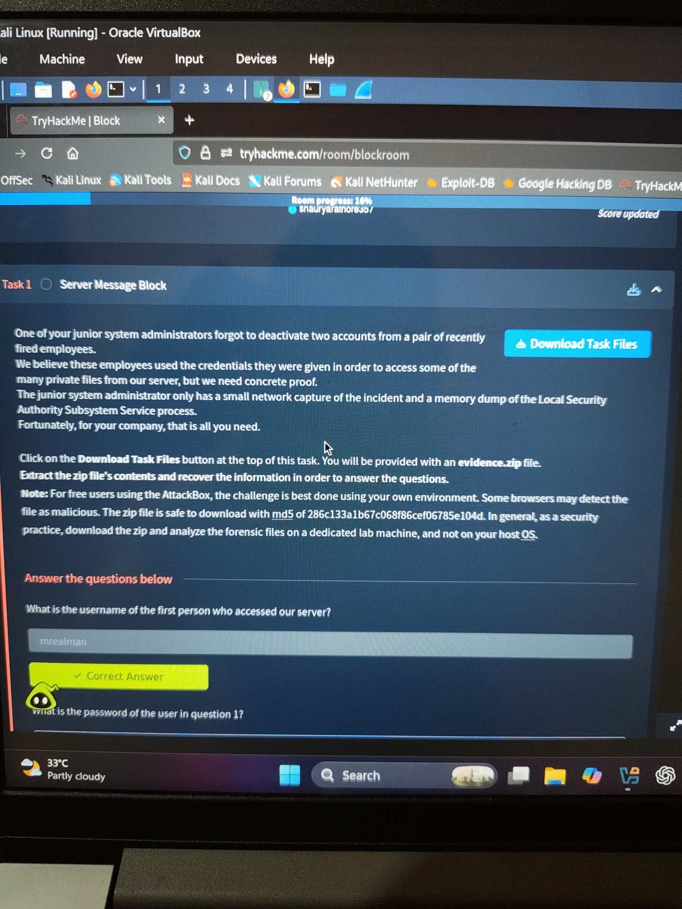
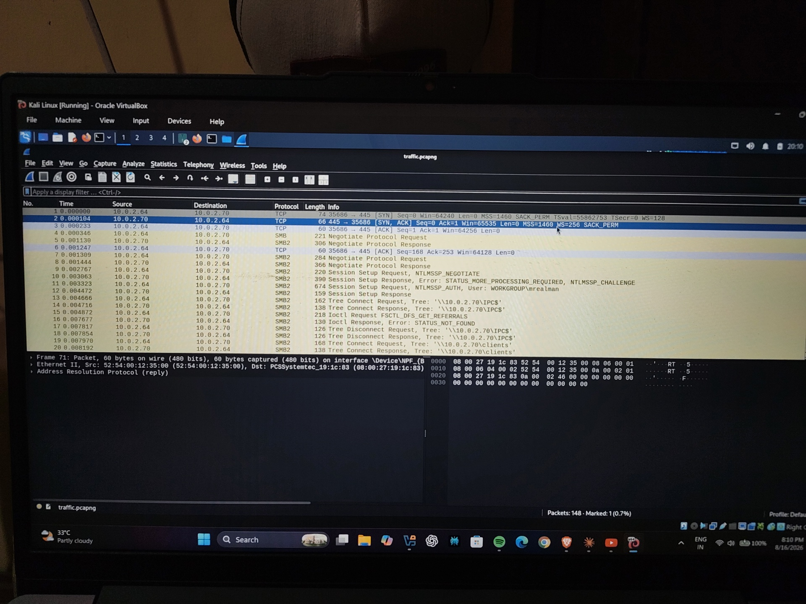
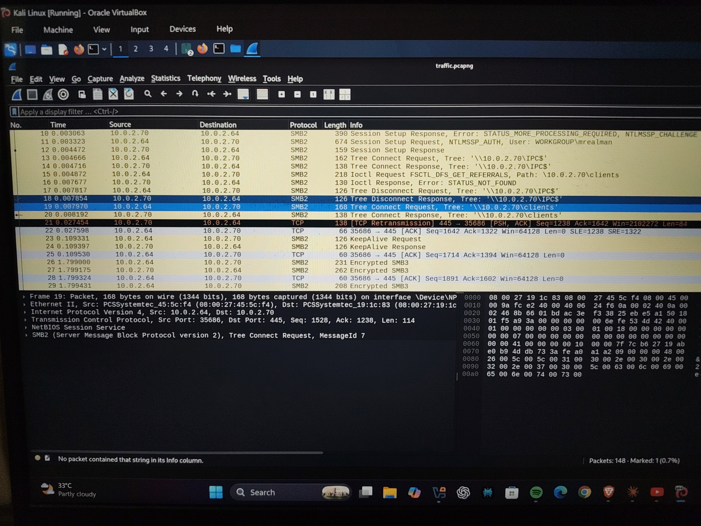
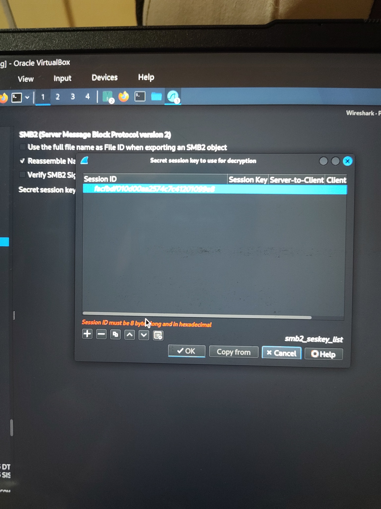
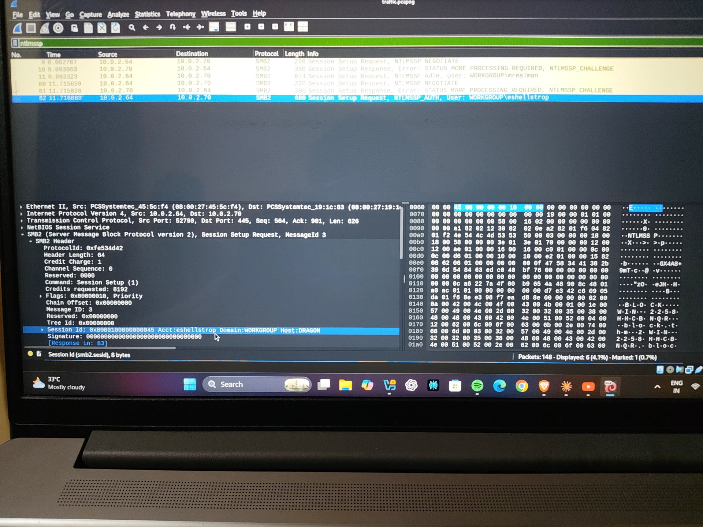
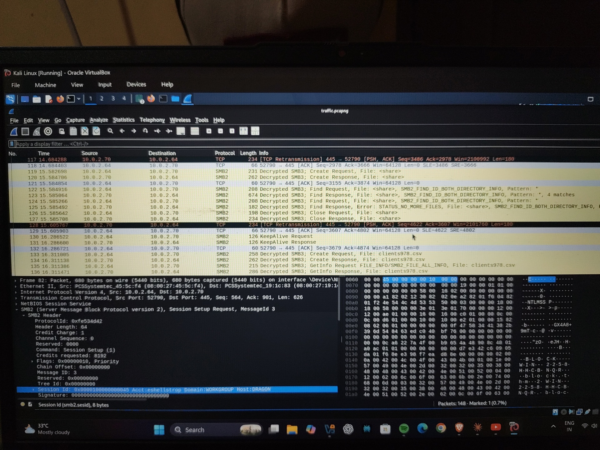
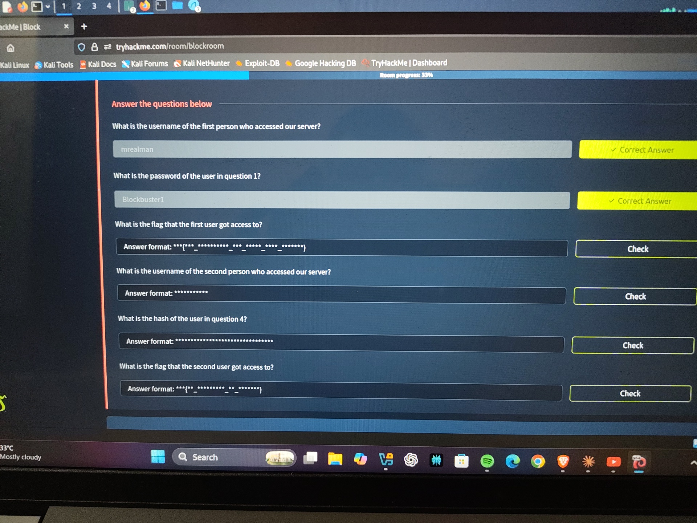

# TryHackMe: Block — Writeup

**Room:** [tryhackme.com/room/blockroom](https://tryhackme.com/room/blockroom)
**Category:** DFIR / Network Forensics
**Difficulty:** Medium

## Scenario

A junior system administrator forgot to deactivate two accounts belonging to recently fired employees. We're told these employees used their old credentials to access private files on the company server. To prove it, we're given two pieces of evidence:

- `traffic.pcapng` — a network capture of the incident
- `lsass.DMP` — a memory dump of the LSASS (Local Security Authority Subsystem Service) process from the server

The goal: extract credentials from the memory dump, use them to decrypt the encrypted SMB3 traffic in the capture, and recover the files each user accessed.

---

## Step 1 — Extract credentials from the LSASS dump

LSASS holds authentication material in memory for every logged-on user. We can pull this out with `pypykatz`, a Python reimplementation of Mimikatz:

```bash
pip install pypykatz --break-system-packages
pypykatz lsa minidump lsass.DMP
```

This dumps every `LogonSession` found in the memory image, including NT hashes, Kerberos keys, and DPAPI material. Scanning through the output for real user accounts (as opposed to machine/service accounts), two stand out:

```
username mrealman
NT: 1f9175a516211660c7a8143b0f36ab44

username eshellstrop
NT: 3f29138a04aadc19214e9c04028bf381
```

**Answer — Username of the first person who accessed the server:** `mrealman`

---

## Step 2 — Crack the NTLM hash

With the NT hash for `mrealman` in hand, we crack it offline with John the Ripper against `rockyou.txt`:

```bash
echo 'mrealman:1f9175a516211660c7a8143b0f36ab44' > hash.txt
john --format=NT --wordlist=/usr/share/wordlists/rockyou.txt hash.txt
john --show --format=NT hash.txt
```

```
mrealman:Blockbuster1
```

**Answer — Password of the user in question 1:** `Blockbuster1`

eshellstrop's hash doesn't crack against rockyou.txt — we'll come back to that and use the raw NTLM hash directly later instead of a plaintext password.



---

## Step 3 — Explore the packet capture

Opening `traffic.pcapng` in Wireshark, the traffic is almost entirely SMB. Filtering on `ntlmssp` shows the authentication handshakes and confirms both users connecting to the server:

- `mrealman` authenticates first, then connects to a share named `clients`
- `eshellstrop` authenticates in a later session

Right after each successful login and share connection, the SMB traffic switches to **Encrypted SMB3** — the protocol's built-in encryption kicks in once a session is established, so filenames and file contents aren't visible in plaintext.





---

## Step 4 — Decrypt mrealman's SMB3 session

SMB3 encryption keys are derived per-session from the NTLMv2 authentication exchange. Since we have `mrealman`'s plaintext password, we can compute the session key ourselves and hand it to Wireshark.

From the `NTLMSSP_AUTH` packet in mrealman's session, we pull two values:

- **NTProofStr** (part of the NTLMv2 Response)
- **Encrypted Session Key**

Using a Python script (based on the well-known ["Decrypting SMB3 Traffic with just a PCAP"](https://medium.com/maverislabs/decrypting-smb3-traffic-with-just-a-pcap-absolutely-maybe-712ed23ff6a2) technique), we derive the **Key Exchange Key** from the password, then RC4-decrypt the Encrypted Session Key to recover the **Random Session Key**:

```bash
python3 calc_smb_session_key.py \
  -u mrealman -d BLOCK -p Blockbuster1 \
  -n <NTProofStr> -k <EncryptedSessionKey>
```

In Wireshark, we go to **Edit → Preferences → Protocols → SMB2**, and add an entry with:

- **Session ID** — copied from the SMB2 header of the session (reversed byte order, due to endianness)
- **Session Key** — the Random Session Key computed above

Clicking OK, the SMB3 traffic for mrealman's session decrypts immediately. Browsing the now-readable traffic, we see the client reading a file called `clients156.csv` off the `clients` share.

We export it via **File → Export Objects → SMB**, save it, and open it:

```
first_name,last_name,password
...
...,THM{SmB_DeCrypTing_who_Could_Have_Th0ughT}
...
```

**Answer — Flag the first user got access to:** `THM{SmB_DeCrypTing_who_Could_Have_Th0ughT}`

---

## Step 5 — Identify the second user

Back in the LSASS dump output, the second real user account is:

```
username eshellstrop
NT: 3f29138a04aadc19214e9c04028bf381
```

**Answer — Username of the second person who accessed the server:**
`eshellstrop`

**Answer — Hash of the user in question 4:**
`3f29138a04aadc19214e9c04028bf381`

---

## Step 6 — Decrypt eshellstrop's SMB3 session

eshellstrop's password didn't crack, but we don't actually need it — the NTLMv2 key derivation works from the raw NT hash just as well.

Filtering Wireshark on `ntlmssp` again, we locate eshellstrop's `NTLMSSP_AUTH` packet and expand it down to:

```
NTLM Secure Service Provider
  User name: eshellstrop
  Host name: DRAGON
  Session Key: c24f5102a22d286336aac2dfa4dc2e04
  NTLM Response → NTProofStr: 0ca6227a4f00b9654a48908c4801a0ac
```



We feed the NT hash (instead of a password) into the same script:

```bash
python3 calc_smb_session_key.py \
  -u eshellstrop -d WORKGROUP -ph 3f29138a04aadc19214e9c04028bf381 \
  -n 0ca6227a4f00b9654a48908c4801a0ac -k c24f5102a22d286336aac2dfa4dc2e04
```

```
Key Exchange Key   : 9754d7acae384644b196c05cda5315df
Random Session Key : facfbdf010d00aa2574c7c41201099e8
```

We also grab the SMB2 **Session ID** from the same packet's SMB2 header — `0x0000100000000045` — and reverse the byte order for Wireshark's format:



```
Session ID (reversed): 4500000000100000
Session Key:           facfbdf010d00aa2574c7c41201099e8
```

Both values go into **Edit → Preferences → Protocols → SMB2**, same as before. The traffic decrypts, and we see the client reading `clients978.csv` off the share:



Exporting it via **File → Export Objects → SMB** and opening the file:

```
first_name,last_name,password
...
Tonye,Risebrow,THM{No_PasSw0Rd?_No_Pr0bl3m}
...
```

**Answer — Flag the second user got access to:** `THM{No_PasSw0Rd?_No_Pr0bl3m}`

---

## Final Answers



| # | Question | Answer |
|---|----------|--------|
| 1 | Username of the first person who accessed the server | `mrealman` |
| 2 | Password of the user in question 1 | `Blockbuster1` |
| 3 | Flag the first user got access to | `THM{SmB_DeCrypTing_who_Could_Have_Th0ughT}` |
| 4 | Username of the second person who accessed the server | `eshellstrop` |
| 5 | Hash of the user in question 4 | `3f29138a04aadc19214e9c04028bf381` |
| 6 | Flag the second user got access to | `THM{No_PasSw0Rd?_No_Pr0bl3m}` |

---

## Tools Used

- [pypykatz](https://github.com/skelsec/pypykatz) — credential extraction from the LSASS minidump
- [John the Ripper](https://www.openwall.com/john/) — offline NTLM hash cracking
- [Wireshark](https://www.wireshark.org/) — packet capture analysis and SMB3 decryption
- Custom Python script for NTLMv2 Random Session Key derivation (`calc_smb_session_key.py`, included in this repo)

## Key Takeaway

SMB3 encryption isn't unbreakable to a passive observer who also has access to the authentication exchange and either the user's password or NT hash. Because the SMB3 session key is derived deterministically from the NTLMv2 handshake, capturing that handshake plus recovering credentials from a memory dump is enough to fully decrypt the session — a good reminder of why credential hygiene (rotating passwords immediately after employee offboarding) matters as much as network-level encryption.
